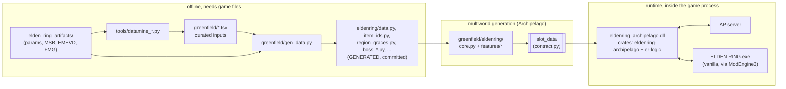

# Architecture — how Elden Ring becomes an Archipelago island

How this repo's code is organised, and how the pieces interact to turn a vanilla
Elden Ring install into a participant in an Archipelago multiworld.

Audience: someone who knows what Archipelago is and wants to understand *this*
implementation. Companion documents: `greenfield/CONTRACT.md` (the exact wire
format), `PROVENANCE.md` (where the data comes from), `CLAUDE.md` (working rules).

---

## 1. The problem, and the shape of the solution

Archipelago needs four things from a game before it can join a multiworld:

1. **Locations** ("checks") — addressable places an item can be placed.
2. **Items** — things that can be placed, some of which are *progression*.
3. **Logic** — a rule per location saying which items you must hold to reach it,
   so the randomiser can prove the seed is completable.
4. **A client** — something inside the game that notices a check was collected,
   reports it to the server, and grants items the server sends back.

Elden Ring supplies none of these natively. This project derives 1–3 from vanilla
game data and implements 4 as a runtime DLL. The whole system is three programs
in two languages, joined by one JSON contract:



The key architectural decision is **pure runtime**: no game file is ever patched.
The client reads the seed's layout from `slot_data` at connect and does everything
live — polling flags, granting items, lighting graces, enforcing region locks,
rewriting param rows in memory. That decision is why the data pipeline can be
"generate once, commit, ship" and why the same DLL serves every seed.

---

## 2. The data pipeline — where locations and items come from

**`greenfield/gen_data.py`** (~8.8k lines) is the single generator. It reads
vanilla game data (`elden_ring_artifacts/`, gitignored, never distributed) plus
curated `.tsv` tables, and writes every data module in `greenfield/eldenring/`:

| Generated module | Contents |
|---|---|
| `data.py` | `HUB`, `REGIONS` (28: 17 base + 11 DLC), `LOCATIONS = {region: [(name, ap_id, flag)]}` — **4,931 locations**, 224 of them in Roundtable Hold |
| `item_ids.py` | `ITEM_CATALOG` (2,084 vanilla `name -> ER FullID`), `LOCATION_ITEM` (4,864 `ap_id -> vanilla item name`), `FILLER_POOL` (228 junk goods) |
| `region_graces.py`, `region_open_flags.py`, `region_play_ids.py` | grace warp flags, per-region open flags, play_region buckets |
| `boss_data.py`, `boss_drops.py`, `boss_sweeps.py`, `boss_reward_lots.py` | boss arenas, drop flags, dungeon sweep triggers |
| `shop_data.py`, `shop_stock_data.py`, `item_tiers.py`, `location_tags.py`, `missable_locations.py` | shop rows, curated PvE tiers, per-location tag sets |

The unit that makes all of this work is the **event flag**. Elden Ring sets a
persistent event flag when you acquire an item ("acquisition flag"). That flag is
the location's identity: it is what the client polls to detect a check, and what
`gen_data` uses to join a location to its region, its boss, its map, and its
vanilla item. A location tuple is literally `(display name, AP location id,
acquisition flag)`.

Three properties of this pipeline are enforced rather than hoped for:

- **Derived, never typed.** Each generated module carries a `_GEN_STAMP` with an
  `inputs_hash`; CI regenerates and fails on a non-empty `git diff`.
- **Reproducible.** A Windows regen and a Linux CI regen must produce identical
  bytes (sorted sets, `sort_keys`, `newline="\n"`, `eol=lf`).
- **Provenance-clean.** No data from any other randomizer, enforced by
  `tools/check_integrity.py` as a pre-commit hook. See `PROVENANCE.md`.

---

## 3. The apworld — `greenfield/eldenring/`

This is the Archipelago `World` subclass, loaded by AP at generation.

### 3.1 core.py + registry.py: a spine and a plug-in bus

`core.py` owns only what every seed needs: region scope, the hub-and-spoke region
graph, locks, the goal, item-pool assembly, and slot_data. Everything else is a
**feature** — one self-registered file in `features/` (about 40 of them):

```python
@register
class Scaling(Feature):
    name = "scaling"
    OPTIONS = {"completion_scaling_floor": ScalingFloor}   # merged into GFOptions
    ITEMS   = {}                                           # {name: ItemClassification}
    def generate_early(self, world): ...
    def create_items(self, world):   return []             # extra pool items
    def create_regions(self, world): ...
    def set_rules(self, world):      ...                   # extra access rules
    def slot_data(self, world):      return {...}
```

`registry.py` aggregates the hooks; `core.py` calls each aggregate at the right
point in AP's lifecycle. Adding a phase therefore touches **no shared file**,
which is why features could be built in parallel without collisions. The registry
also enforces global uniqueness of option field names, item names and slot_data
keys, and *unions* the one key that is genuinely multi-owner
(`requiresClientFeatures`).

### 3.2 Generation lifecycle

| AP hook | What happens here |
|---|---|
| `generate_early` | `defaults.apply_frozen` installs frozen option values; resolve DLC scope → `gf_eligible`; `region_spine.compute_kept` draws the kept regions; resolve the goal and required Great Runes; then every feature's `generate_early` |
| `create_regions` | build `Menu → Roundtable Hold → each kept region`; attach locations; gated children hang off their parent, not the hub |
| `create_items` | mint Region Locks, precollect the start anchor, let features contribute, then fill the remaining slots count-exactly |
| `set_rules` | install the completion condition; features add access rules |
| `pre_fill` | `features/progression_surface` places this world's own progression onto a restricted surface |
| `post_fill` | the **coverage gate** — a raising, gen-time invariant over every emitted location |
| `fill_slot_data` | `core._base_slot_data` + `_options_echo` + every feature's contribution, validated against `contract.py` |
| `write_spoiler` / `generate_output` | scaling spheres, the full slot_data dump, a per-slot check breakdown |

---

## 4. How progression logic is encoded

This is the part that differs most from a conventional apworld, and the part
worth understanding first.

### 4.1 The Shattering: region locks are the logic

Elden Ring is an open world; vanilla gating is weak and mostly optional, which
makes a poor progression graph. So the world is **Shattered**: carved into 28
regions, each sealed behind a synthetic AP item named `"<Region> Lock"`.

- `region_spine.compute_kept(n, rng, eligible, forced, ...)` decides which
  regions are in play. `num_regions` is a **draw size**, not a final count — a
  named goal force-keeps regions and parent closure pulls ancestors in.
- `core.create_regions` connects each kept region to the hub with the rule
  `state.has("<Region> Lock", player)`. That single edge *is* the logic: every
  location inside the region inherits it.
- The completion condition is `state.has_all(kept_lock_names)` — optionally plus
  N Great Runes (`ending_condition: great_runes`).
- `kept_lock_names()` is deliberately the **single source** for both the AP-side
  completion condition and the client-side `goalRequiredItems`, so the two
  terminal conditions cannot drift apart.

Because Locks are the sole progression, **any item shuffle is winnable by
construction** — a property the codebase leans on constantly.

### 4.2 Four gating layers on top of the lock

The lock is a coarse instrument. Four features refine it, each adding an *extra*
requirement, never replacing the Lock:

1. **`region_spine.REGION_PARENT` — gated children.** Raya Lucaria Academy →
   Liurnia, Leyndell → Altus, Sewer → Leyndell. These sit behind a wall the
   *game* enforces, so their AP region is parented under the ancestor rather than
   the hub, and `features/graces.py` **withholds** their grace bundle (you walk in
   the vanilla way instead of warping past the wall). A 2026-07-14 playtest bug —
   being handed a warp target past Leyndell's rune gate — is why this exists.
2. **`features/legacy_key_gates.py`** — a legacy dungeon folded into a parent
   region needs its real key item *in addition to* the parent Lock (e.g. Academy
   Glintstone Key). Table-driven, keyed by acquisition-flag ranges, because a
   map-lot flag encodes its map.
3. **`features/leyndell_gate.py`** — the capital additionally needs N Great Runes,
   mirroring vanilla. N is **floored, not clamped**: the game's own 2-rune wall
   does not clamp with us.
4. **`features/boss_locks.py`** — optional Boss Keys, plus `dungeonSweepFlags`
   (kill a dungeon boss → its remaining checks auto-grant).

Whenever a feature makes an item logically necessary, `core._class_for` upgrades
that item to `progression` (Great Runes and legacy keys are GOODS, i.e. filler by
default), so AP's fill guarantees it reachable.

### 4.3 Reachability honesty: three ways a check can lie

A check AP believes is reachable, but which physically is not, produces an
unwinnable seed. `core._add_locations` bars advancement on three sets:

| Set | Cause |
|---|---|
| `DEFAULTED_REGION_APS` | the derivation *guessed* the region (hub fallback) — the item may physically sit in a sealed region |
| `ERDTREE_BURN_APS` | killing Maliketh burns the Erdtree and destroys normal Leyndell — 79 checks gone, permanently (lifted when the capital reconciler is armed) |
| `SHOP_RELEASE_GATED_APS` | the merchant does not *stock* the row until an unlock event fires; region reachability is necessary but not sufficient |

The bar is applied as an `item_rule`, not `LocationProgressType.EXCLUDED` —
excluding routes them into AP's excluded-fill pass, which must fill every such
location from the plain filler pool and FillErrors on shop slots carrying their
own item rules. Real seed this class of bug killed:
`AP_55352390472076588352` (Stormveil Lock placed on a guessed-region check).

### 4.4 Progression shape: `features/progression_surface.py`

Scattering region Locks uniformly over ~4,900 checks makes a boring seed. This
feature implements the *hard* restriction thefifthmatt's standalone randomizer
uses: pull this world's own progression out of the pool and place it, via
`Fill.fill_restrictive`, onto a curated surface only (default: the ~24 major boss
arenas). It never hard-fails — it widens the surface one confidence-ranked rung
at a time (`MajorBoss → +Remembrance,GreatRune → +KeyItem → +Boss → +Legendary →
+Seedtree,Church`) and returns anything still unplaced to the normal pool.

A companion knob, `confine_foreign_progression`, bars *other players'*
advancement from our non-surface checks, so a multiworld's important items land
where an Elden Ring player will actually look.

### 4.5 Two alternative topologies

Both are inverses of the Shattering and mint **zero** synthetic locks:

- **`features/natural_progression.py`** — the whole eligible map is in play and
  each region opens on its *real* vanilla key items / remembrances, shuffled into
  the multiworld. Vanilla's dependency shape, AP's ordering.
- **`features/vanilla_placement.py`** — every item back in its base-game spot;
  the base game's own doors do all the gating (for groups who want DeathLink and
  nothing else randomised).

Both need `has("<R> Lock")` to keep meaning "region R is open", because dozens of
features ask that question. Rather than teach every feature about the mode,
`core.create_regions` places `"<R> Lock"` as an **AP event** (`code=None`) inside
each region — never in the pool, never granted, never received. Every existing
lock-gated rule keeps working unchanged.

### 4.6 The coverage gate

`coverage.py` (~1k lines, hand-authored) runs in `post_fill` and **raises**. For
every location the seed emits it asserts:

- **detectable** — carries a real acquisition flag present in `locationFlags` /
  `shopRowFlags`, valid, and not accidentally aliased to another live location
  (shared flags are legal only as a declared co-check group);
- **suppressed** — if the location vanilla-holds an item, some mechanism prevents
  the vanilla item being handed out alongside the AP-placed one.

This is the gate that converts "we think the client can see this check" into a
generation-time proof.

---

## 5. How items are randomized

### 5.1 The pool is built count-exact

`core.create_items` is the whole story:

```
pool  = Region Locks (kept regions)            # minus the precollected start anchor
      + Ashen Capital Lock (if the finale exists)
      + every feature's create_items()          # boss keys, progressive copies, juice, ...
slots = total_locations - len(pool)             # the filler tail
```

`slots` is then filled from a shuffled list of the locations' own vanilla items,
sorted so `Rune` fallbacks land **last**. Because the tail is sorted that way,
anything a feature adds to `pool` trims one item off the *Rune* end — so a
feature can upgrade filler quality without ever changing the item count.

### 5.2 What "shuffle" means here

With `item_shuffle` on (frozen ON in shipped seeds), each location's own vanilla
item — from `LOCATION_ITEM`, which binds 4,864 of the 4,931 locations — becomes
an AP item, and all of them are shuffled among the checks. Unbound locations fall
back to `Rune` filler. Items are identified **by name**; `apIdsToItemIds` maps the
AP item id to the ER *FullID* the client grants on receipt (the FullID's high
nibble encodes the category, e.g. `0x40000000` for GOODS).

Region Locks remain the only progression, so the shuffle can never strand the
run — which is exactly what makes aggressive pool curation safe.

### 5.3 The filler tail has exactly one owner

`features/filler_budget.py` exists because three passes once each owned a slice of
the same resource with no contract between them (a live playtest reached fill
sphere 2 holding a +0 weapon, and nothing raised). Now:

```
partition   -> every tail slot the seed has (rune fallbacks + displaceable junk)
               minus what locks / boss keys / progressive already consumed
allocate    -> the recipe, applied ONCE; economy categories (stones, somber, runes)
               are reserved off the top, everything else splits the remainder by weight
materialize -> core writes the plan into the tail slots; there is no second pass
```

Feeding it: `pool_builder.py` (S/A-tier "juice" gear, `useful`, never
progression), `filler_curation.py`, `varied_filler`, `presence_floor.py`,
`scadu_supply.py`, and `item_tiers.py` (curated PvE tiers, `S→3 A→2 B→1 C/D/F→0`,
with the ER param `rarity` filling gaps).

### 5.4 Items that are not simple grants

- **`features/progressive.py`** — collapses fungible upgrade families into one
  `Progressive X` item whose Kth copy grants tier K via the client's
  `progressiveGrants` ladder. Progressive Flasks (default on) *substitute* for
  every Golden Seed / Sacred Tear check one-for-one, keeping the pool count-exact
  and letting the ladder length follow whatever checks the seed kept.
- **`features/shops.py` / `shop_stock.py` / `rune_pricing.py` / `minibaker.py`** —
  merchant shelves as checks, infinite-stock rows, rune pricing.
- **`features/traps.py`, `start_items.py`, `start_grace.py`** — the opening
  loadout and which region the run opens on (a size-weighted draw, deliberately
  *not* the goal region).
- **`hold_cap.py`** — respects the game's per-good stack ceiling so a grant can't
  be silently dropped.

### 5.5 Preventing the double-dip

If an AP item is placed on a check, the vanilla item must not *also* be handed
out. Naively suppressing by item id ate every copy from every source (Golden Rune
[1] backs 46 checks; picking one up anywhere was eaten until all 46 were
collected). The fix answers the question at the source, statically:

- **GOODS** are blanked *at the lot* — the client repoints the check's
  `ItemLotParam` goods slots at a placeholder (`checkLotBlankMap/Enemy`);
- **WEAPON / ARMOR / TALISMAN / Ash of War** are suppressed by FullID
  (`checkItemFlags`);
- farmable goods (`REPEATABLE_GOODS`) are deliberately never id-suppressed.

---

## 6. The seam: `slot_data` and the contract

`contract.py` declares every key once — name, wire shape, required-ness, profile,
producing module, **consuming Rust file:function**, and a one-line semantic —
and `validate_slot_data()` checks the assembled dict at generation. Emission is
strict in both directions: an undeclared key raises at merge time, a declared but
missing required key raises at validation. `to_markdown/json/rust` emit
`greenfield/CONTRACT.md` and the Rust-side mirror, so both halves validate the
same contract.

94 declared keys (counting the `options.*` sub-keys, the legacy top-level
duplicates, and a handful marked `DEAD`), in families:

| Family | Keys | What the client does with them |
|---|---|---|
| **Detection** | `locationFlags`, `shopRowFlags`, `locationRegions`, `regionCoarseKeys` | poll acquisition flags → send checks; group them for the tracker |
| **Granting** | `apIdsToItemIds`, `progressiveGrants`, `flaskLadder`, `uniqueStartGrants`, `startItems` | turn a received AP item into an in-game grant |
| **Region locking** | `regionOpenFlags`, `areaLockFlags`, `lockRevealFlags`, `regionGraces`, `graceAttunement` | light graces on lock receipt; kick the player out of sealed ground |
| **Suppression** | `checkItemFlags`, `checkLotBlank*`, `checkLotZero*`, `apPlaceholderGoods` | stop the vanilla ware paying out at a check |
| **Difficulty** | `regionSphereTargetRanges`, `dlcRegionBuckets`, `scaduBlessingCap`, `completionScalingBasis` | scale enemies to the seed's progression order |
| **Goal** | `goalLocations`, `goalRequiredItems` | know when the run is won |
| **Capital** | `capitalBurnFlag`, `capitalAshenPlayRegions`, … | keep the Erdtree-burn state coherent with the player's capital |
| **Options echo** | `options.*` | every runtime toggle the client reads (`er-logic/options.rs`) |

Two mechanisms keep the halves honest at runtime: `requiresClientFeatures`
(per-seed list of what the client must understand) and the contract-hash
handshake — the apworld and DLL are a **hash-matched pair**, and a mismatched
apworld is reported loudly in the client log on connect.

---

## 7. The runtime client (Rust, submodule)

Not present in this checkout (`from-software-archipelago-clients/` is an
unfetched submodule), but its responsibilities are fully specified by
`CONTRACT.md`'s consumer column. It builds `eldenring_archipelago.dll`, loaded as
a `[[natives]]` entry by ModEngine3 (`me3/ap.me3`), across crates
`eldenring-archipelago` (hooks, game interop) and `er-logic` (pure, unit-tested
logic — `options.rs`, `region_lock.rs`, `scaling.rs`, `capital.rs`,
`tracker_tables`, `static_lots.rs`).

The runtime loop:

1. **connect** — read `slot_data`, validate it against the mirrored contract,
   build the flag-poll tables;
2. **detect** — poll acquisition flags; a flag that fires maps to an AP location
   id and is sent to the server as a check;
3. **grant** — a received AP item maps through `apIdsToItemIds` to a FullID and is
   granted via the hooked `AddItemFunc` (which is why me3 disables Arxan);
4. **enforce** — `kick_decision()` reduces the player's 7-digit overworld
   `play_region` id to its 5-digit subregion and warps them back to Roundtable
   Hold if that subregion sits in a range whose open flag is off;
5. **open** — on lock receipt, set the region's open flag (which disarms the kick)
   and light that region's grace warp flags — except past a vanilla wall, where
   the bundle is deliberately empty;
6. **rewrite** — repoint `ItemLotParam` rows in memory to suppress vanilla wares,
   reroll unflagged enemy drops, adjust shop stock and prices, apply completion
   scaling.

---

## 8. Enemy randomization — the deliberate seam with thefifthmatt's randomizer

**This project does not randomize enemies or starting classes, by design.**
`release/ENEMY-AND-STARTING-CLASS-RANDOMIZATION.md` is the shipped recipe for
running **thefifthmatt's Elden Ring Item and Enemy Randomizer** *alongside* an
Archipelago seed. The two compose because they work at different layers:

| | matt's randomizer | this project |
|---|---|---|
| Mechanism | rewrites game files (`regulation.bin` and friends) | pure runtime, no file writes |
| Owns | enemy placement, boss shuffle, starting class | items, checks, logic, region locks |
| Configured | in its own GUI, **Item Randomizer OFF** | your `EldenRing.yaml` |

Two rules make it work: matt's item randomization must be **off** (items are this
project's job), and `RandomizerHelper.dll` must **not** be loaded (it breaks item
receiving; its auto-equip/auto-upgrade are already yaml options here).

The deeper reason there is no in-repo enemy randomizer is **provenance**. The
codebase is "matt-free" as a hard rule: every table is derived from scratch
against vanilla game data, and `tools/check_integrity.py` blocks any commit
carrying matt-lineage location-key grammar. Duplicating a mature, well-liked tool
would trade that clean-room derivation for no player benefit. `PROVENANCE.md`
row 2 and `release/ATTRIBUTION.md` state the position; the project links to
Nexus rather than mirroring anything.

What *is* enemy-adjacent here is `features/enemy_drops.py`, and it is a different
thing: `ItemLotParam_enemy` splits into 244 flagged rows (one-time drops that are
real checks — never touched) and 4,891 unflagged rows (farmable, repeatable). The
unflagged set is rerolled per seed to high-impact consumables, on the predicate
*a lot with no flag cannot be a check, so it is free to reroll*.

---

## 9. Verification

The project's stated bar is that code-reading is not evidence. The gates, all
runnable from `run_ci.ps1`:

| Gate | What it proves |
|---|---|
| `tools/gf_test.py` (158 test files) | the suite, inside a **pinned upstream** Archipelago in `.ap-test/` — it refuses to run against a fork, because that once produced 661 vs 686 collected tests and different fill spheres |
| fill regression / region diversity | placement quality and that every base region actually appears across seeds (measured: 34–37% each) |
| freshness | the committed generated data matches its `inputs_hash` |
| gen fuzz (`fuzz_gf.py`, `gen_fuzz.ps1`) | random option combinations generate clean or reject gracefully — the headline gate |
| coverage gate | every emitted check is detectable and suppressed |
| contract tests | slot_data shapes, version handshake, client-path existence |
| `cargo test` | `er-logic`, `er-codec`, `er-semver` pure crates |

Two suite-level guards worth knowing: a **skip census** (an unexplained skip fails
the run) and a **quantifier-emptiness spy** (`all()` over an empty set passes for
the wrong reason).

---

## 10. Everything else in the tree

- **`wizard/`** — a static options wizard (`wizard.html`) built from
  `options-metadata.json`, itself dumped from the live option surface. Its
  `fetch()` is same-origin only, so a locally opened wizard sends nothing
  anywhere. Four CI gates keep it from drifting from the apworld's real options.
- **`poptracker/`** — a PopTracker pack (Lua) fed by `locationRegions` /
  `regionCoarseKeys` and slot_data.
- **`build.ps1`** — regen, package, generate, cargo build, me3 deploy, serve.
  Its only writes outside the repo are the me3 staging dir and its own DLL inside
  `ELDEN RING\Game\mods\`.
- **`release/`** — the player-facing surface: `SETUP.md`, the annotated shipped
  `EldenRing.yaml`, `KNOWN-ISSUES.md`, changelog, attribution.
- **`docs/history/`** — superseded designs kept for provenance. Not guidance.
